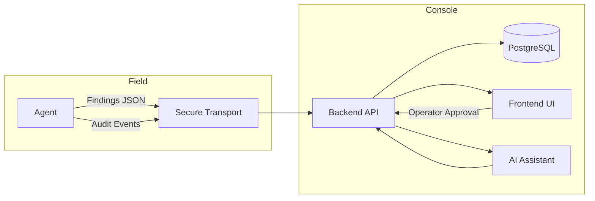

# Architecture Overview

This document gives a high-level view of KYNEE components and how data flows between them.

---

## Components

- **Agent**: Runs on Raspberry Pi, performs scoped data collection.
- **Console Backend**: FastAPI service that manages engagements and ingests findings.
- **Console Frontend**: React UI for operators.
- **Secure Transport**: WireGuard tunnel with HTTPS fallback.
- **AI Assistant**: Suggests next steps, requires human approval.
- **Audit Log**: Append-only, hash-chained records for accountability.

---

## Data Flow

---

## Trust Boundaries

- **Agent to Console**: Encrypted channel with device identity.
- **Operator Actions**: Require authentication and are logged.
- **AI Suggestions**: Non-executable until approved by a human.

---

## Key Design Principles

- **Scope enforcement first**: No out-of-scope actions.
- **Human-in-the-loop**: AI can suggest but cannot act.
- **Auditability**: Every action is logged with context.
- **Secure by default**: Encrypted transport, minimal privileges.

---

## Related Decisions

See the ADRs in [docs/architecture](./adr-0000-index.md).
